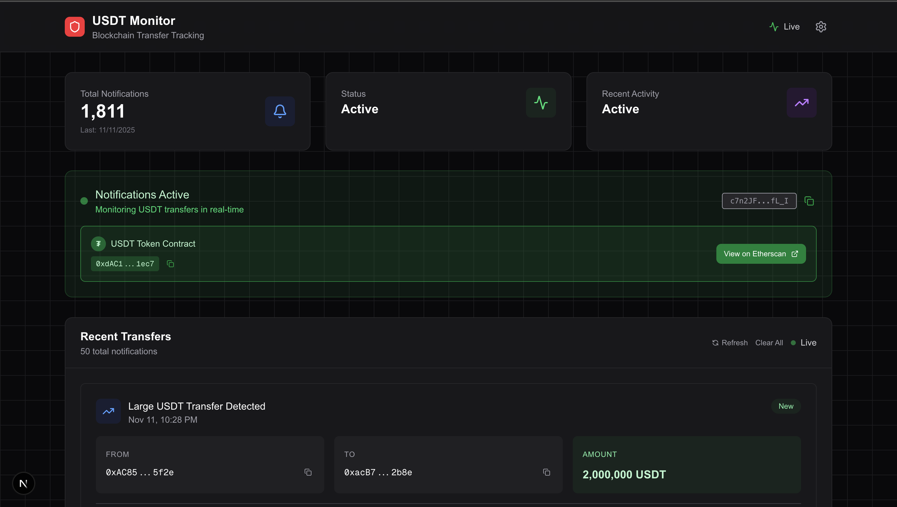
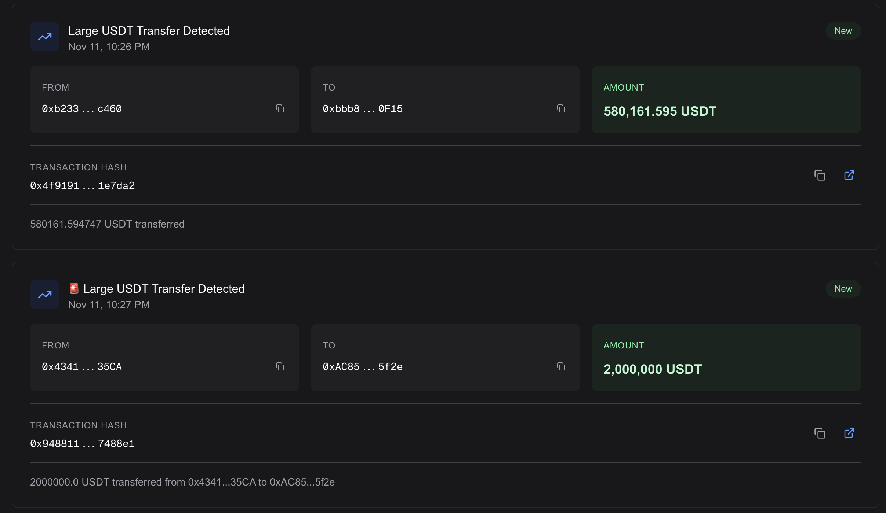
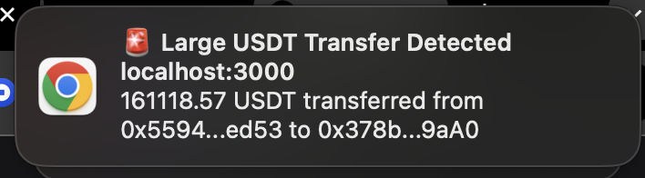
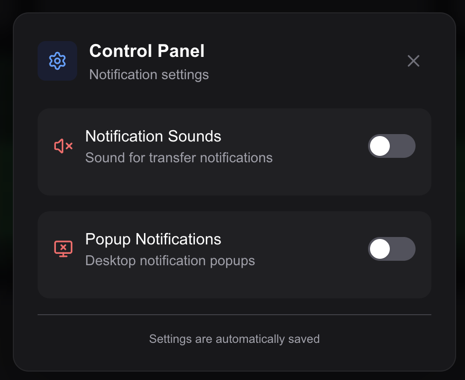
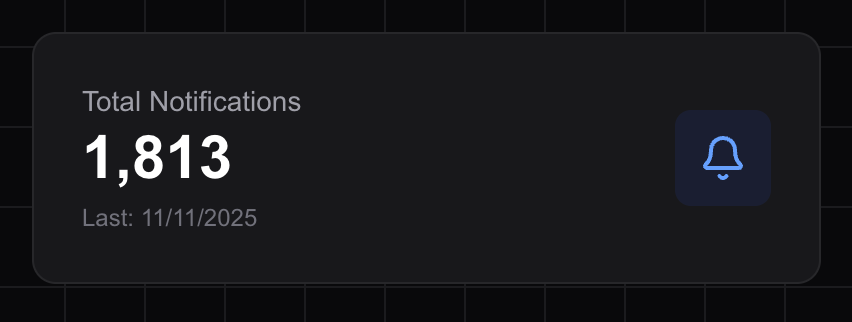
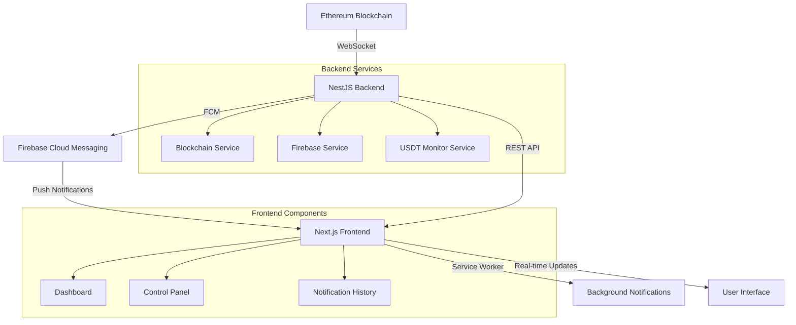
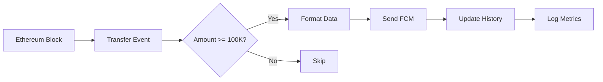

# 🔍 USDT Transfer Monitörü

Ethereum blockchain'deki büyük USDT transferlerini gerçek zamanlı olarak izleyen ve Firebase Cloud Messaging (FCM) ile anında bildirimler gönderen modern, full-stack bir monitoring uygulamasıdır.

## 📸 Uygulama Önizlemesi

### � Ana Dashboard

*Modern ve responsive ana sayfa tasarımı*

### 📊 Transfer Bildirimleri

*Gerçek zamanlı transfer bildirimleri ve detayları*

### 🔔 Pop-up Bildirimler

*Browser notification ile background bildirimler*

### ⚙️ Kontrol Paneli

*Bildirim ayarları ve kullanıcı tercihleri*

#### Yardım Alma
- 📖 **Dokümantasyon**: Bu README ve `/docs` klasörü
- 🐛 **GitHub Issues**: Bug reports ve feature requests  
- � **Discussions**: Genel sorular için GitHub Discussions

---

**🔥 Canlı İzleme**: Backend başlatıldığında Ethereum blockchain'i gerçek zamanlı olarak izlemeye başlar ve büyük USDT transferlerini anında tespit eder!atistikler

*Transfer istatistikleri ve toplam bildirim sayısı*

## ✨ Temel Özellikler

### 🔍 **Real-time Blockchain Monitoring**
- Ethereum mainnet'te USDT transferlerini WebSocket ile canlı izleme
- 100,000+ USDT transferleri için otomatik tespit sistemi
- Otomatik reconnection ve error handling

### 📱 **Advanced Notification System**
- Firebase Cloud Messaging ile cross-platform bildirimler
- Foreground ve background notification desteği
- Özelleştirilebilir ses ve popup ayarları
- Rich notification data (gönderen, alıcı, miktar, tx hash)

### 🎨 **Modern UI/UX**
- Next.js 16 + React 19 ile modern frontend
- Tailwind CSS 4 ile responsive tasarım
- Framer Motion ile smooth animasyonlar
- Dark theme odaklı professional görünüm

### 🛠️ **Enterprise-Ready Backend**
- NestJS ile scalable backend architecture
- TypeScript ile type safety
- Docker containerization desteği
- Comprehensive error handling ve logging

## 🏗️ Teknik Mimari



## 📁 Proje Yapısı

```
vinu-digital/
├── 📱 frontend/                          # Next.js Frontend Application
│   ├── src/
│   │   ├── app/                         # Next.js App Router
│   │   │   ├── api/                     # API Routes
│   │   │   │   ├── subscribe/           # FCM subscription
│   │   │   │   ├── notifications/       # Notification APIs
│   │   │   │   └── recent-transfers/    # Transfer history API
│   │   │   ├── layout.tsx              # Root layout
│   │   │   ├── page.tsx                # Main dashboard
│   │   │   └── globals.css             # Global styles
│   │   ├── components/                  # React Components
│   │   │   ├── ControlPanel.tsx        # Settings panel
│   │   │   ├── ClientOnly.tsx          # SSR wrapper
│   │   │   └── grid-background.tsx     # Animated background
│   │   ├── contexts/                   # React Contexts
│   │   │   └── SettingsContext.tsx     # User preferences
│   │   └── lib/                        # Utility Libraries
│   │       ├── firebase/               # Firebase integration
│   │       │   ├── client.ts           # Client SDK
│   │       │   └── admin.ts            # Admin SDK
│   │       └── utils.ts                # Helper functions
│   ├── public/                         # Static Assets
│   │   ├── assets/                     # Application screenshots
│   │   ├── firebase-messaging-sw.js    # Service Worker
│   │   └── notification-sound.mp3      # Notification sound
│   ├── .env.local                      # Environment variables
│   └── package.json                    # Dependencies
│
├── 🚀 backend/                           # NestJS Backend API
│   ├── src/
│   │   ├── blockchain/                 # Blockchain Integration
│   │   │   ├── blockchain.service.ts   # Main monitoring service
│   │   │   └── usdt-monitor.service.ts # Transfer processing
│   │   ├── firebase/                   # Firebase Integration
│   │   │   └── firebase.service.ts     # FCM notifications
│   │   ├── config/                     # Configuration
│   │   │   └── configuration.ts        # App config schema
│   │   ├── app.module.ts              # Root module
│   │   └── main.ts                    # Application entry
│   ├── .env                           # Environment variables
│   ├── Dockerfile                     # Docker configuration
│   ├── docker-compose.yml             # Docker Compose setup
│   └── package.json                   # Dependencies
│
├── 🔐 firebase-service-account.json      # Firebase Admin credentials
├── 📄 README.md                         # Project documentation
└── 🐙 .gitignore                        # Git ignore rules
```

## �️ Teknoloji Stack'i

### Frontend Stack
| Teknoloji | Versiyon | Açıklama |
|-----------|----------|----------|
| **Next.js** | 16.0.1 | React framework (App Router) |
| **React** | 19.2.0 | UI library with concurrent features |
| **TypeScript** | 5.x | Type safety ve developer experience |
| **Tailwind CSS** | 4.x | Utility-first CSS framework |
| **Framer Motion** | 12.23.24 | High-performance animations |
| **Firebase** | 12.5.0 | Client-side Firebase SDK |
| **Lucide React** | - | Modern icon library |

### Backend Stack
| Teknoloji | Versiyon | Açıklama |
|-----------|----------|----------|
| **NestJS** | 11.0.1 | Enterprise Node.js framework |
| **Ethers.js** | 6.15.0 | Ethereum blockchain interaction |
| **Firebase Admin** | 13.6.0 | Server-side Firebase operations |
| **RxJS** | 7.8.1 | Reactive programming |
| **Joi** | 18.0.1 | Schema validation |

## 🚀 Kurulum ve Başlangıç

### 📋 Gereksinimler

```bash
# Sistem gereksinimleri
Node.js >= 18.0.0
npm >= 9.0.0
Git
```

### 1. 📥 Projeyi Klonlayın

```bash
git clone https://github.com/your-username/vinu-digital.git
cd vinu-digital
```

### 2. 🔥 Firebase Projesi Oluşturun

#### Firebase Console Setup
1. [Firebase Console](https://console.firebase.google.com/)'a gidin
2. **Create a project** → Proje adını girin
3. **Project Settings** → **General** → **Your apps** → **Web app** ekleyin
4. **Project Settings** → **Service Accounts** → **Generate new private key**
5. **Project Settings** → **Cloud Messaging** → **Web push certificates** → **Generate key pair**

#### Firebase Configuration
```bash
# İndirilen service account dosyasını root dizine koyun
cp ~/Downloads/vinu-digital-firebase-adminsdk-*.json ./
```

### 3. 🔗 Ethereum Provider Setup

Aşağıdaki servis sağlayıcılardan birinden API key alın:

#### Alchemy (Önerilen)
```bash
# 1. https://alchemy.com adresine kaydolun
# 2. "Create App" → Ethereum Mainnet seçin
# 3. WebSocket URL'ini kopyalayın
```

#### Infura
```bash
# 1. https://infura.io adresine kaydolun
# 2. Yeni proje oluşturun → Ethereum seçin
# 3. Project ID'yi alın
```

### 4. 🖥️ Backend Setup

```bash
cd backend

# Dependencies yükleyin
npm install

# Environment dosyasını oluşturun
cp .env.example .env
```

#### Backend Environment (.env)
```bash
# Ethereum WebSocket URL (Zorunlu)
ETHEREUM_WSS_URL=wss://eth-mainnet.ws.alchemyapi.io/v2/YOUR_API_KEY

# Firebase Service Account Path (Zorunlu)
FIREBASE_ADMIN_CONFIG_PATH=../vinu-digital-firebase-adminsdk-*.json

# Application Port (Opsiyonel)
PORT=3001

# Log Level (Opsiyonel)
LOG_LEVEL=info
```

#### Backend'i Başlatın
```bash
# Development mode
npm run start:dev

# Production mode
npm run build && npm run start:prod

# Docker ile
docker-compose up -d
```

### 5. 💻 Frontend Setup

```bash
cd frontend

# Dependencies yükleyin
npm install

# Environment dosyasını oluşturun
touch .env.local
```

#### Frontend Environment (.env.local)
```bash
# Backend URL
BACKEND_URL=http://localhost:3001

# Firebase Client Configuration
NEXT_PUBLIC_FIREBASE_API_KEY=your_api_key_here
NEXT_PUBLIC_FIREBASE_AUTH_DOMAIN=your_project_id.firebaseapp.com
NEXT_PUBLIC_FIREBASE_PROJECT_ID=your_project_id_here
NEXT_PUBLIC_FIREBASE_STORAGE_BUCKET=your_project_id.firebasestorage.app
NEXT_PUBLIC_FIREBASE_MESSAGING_SENDER_ID=your_sender_id_here
NEXT_PUBLIC_FIREBASE_APP_ID=1:your_sender_id:web:your_app_id

# Firebase VAPID Key (FCM Web Push için)
NEXT_PUBLIC_FIREBASE_VAPID_KEY=your_vapid_key_here

# Firebase Admin SDK (API routes için)
FIREBASE_ADMIN_CONFIG_PATH=./firebase-service-account.json
```

#### Firebase Service Account (Frontend)
```bash
# Service account dosyasını frontend klasörüne kopyalayın
cp ../vinu-digital-firebase-adminsdk-*.json ./firebase-service-account.json
```

#### Frontend'i Başlatın
```bash
# Development mode
npm run dev

# Production build
npm run build && npm start
```

### 6. ✅ Doğrulama

```bash
# Backend health check
curl http://localhost:3001/health

# Frontend erişimi
open http://localhost:3000
```

## 📱 Kullanım Kılavuzu

### 🚀 İlk Başlatma

1. **Frontend'e erişin**: http://localhost:3000
2. **Bildirim iznini verin**: Ana sayfada "Bildirimlere İzin Ver" butonuna tıklayın
3. **Otomatik subscription**: Cihazınız otomatik olarak `largeTransfers` konusuna abone olur
4. **Durum kontrolü**: Yeşil status indicator FCM token'ının başarıyla alındığını gösterir

### ⚙️ Ayarlar Yönetimi

**Kontrol Paneli** (⚙️ ikonu):
- **🔊 Ses Bildirimleri**: Web Audio API ile notification sesi açma/kapatma
- **🖥️ Popup Bildirimleri**: Browser notification'ları kontrol etme
- **💾 Ayar Yönetimi**: Tercihler localStorage'da otomatik kaydedilir

### 📊 Transfer İzleme

**Real-time Monitoring**:
- Backend Ethereum blockchain'i WebSocket ile sürekli izler
- 100,000+ USDT transferleri otomatik olarak tespit edilir
- Her transfer için rich notification gönderilir

**Bildirim Detayları**:
- 📤 **Gönderen**: Wallet adresi (kısaltılmış format)
- 📥 **Alıcı**: Hedef wallet adresi 
- 💰 **Miktar**: Formatlanmış USDT miktarı
- 🔗 **Transaction**: Etherscan link ile blockchain explorer

### 📈 İstatistikler

**Dashboard Metrics**:
- **Toplam Bildirim**: Alınan toplam transfer bildirimi
- **Son Transfer**: En son tespit edilen transfer zamanı
- **Transfer Geçmişi**: Son 50 transfer localStorage'da saklanır
- **Uptime**: Sistem çalışma süresi

## 🔧 Konfigürasyon

### Temel Konfigürasyon

#### Backend (.env)
```bash
PORT=3001
ETHEREUM_WSS_URL=wss://eth-mainnet.ws.alchemyapi.io/v2/YOUR_API_KEY
FIREBASE_ADMIN_CONFIG_PATH=../vinu-digital-firebase-adminsdk-*.json
```

#### Frontend (.env.local)
```bash
# Firebase Client Config
NEXT_PUBLIC_FIREBASE_API_KEY=your_api_key
NEXT_PUBLIC_FIREBASE_AUTH_DOMAIN=your_project.firebaseapp.com
NEXT_PUBLIC_FIREBASE_PROJECT_ID=your_project_id
NEXT_PUBLIC_FIREBASE_STORAGE_BUCKET=your_project.appspot.com
NEXT_PUBLIC_FIREBASE_MESSAGING_SENDER_ID=your_sender_id
NEXT_PUBLIC_FIREBASE_APP_ID=your_app_id
NEXT_PUBLIC_FIREBASE_VAPID_KEY=your_vapid_key
```

📖 **Detaylı konfigürasyon, Docker setup, security ayarları ve troubleshooting için:**  
👉 **[📋 Konfigürasyon Dokümantasyonu](./docs/CONFIGURATION.md)**

## 🎯 Kapsamlı Özellik Listesi

### 🔍 **Blockchain Monitoring Features**

#### Real-time Transfer Detection
- ✅ **WebSocket Connection**: Ethereum mainnet ile sürekli bağlantı
- ✅ **USDT Contract Monitoring**: `0xdAC17F958D2ee523a2206206994597C13D831ec7` adresi izleme
- ✅ **Threshold Filtering**: 100,000+ USDT transferleri için akıllı filtreleme
- ✅ **Event Processing**: Transfer event'lerini real-time işleme
- ✅ **Automatic Reconnection**: Bağlantı kopması durumunda otomatik yeniden bağlanma

#### Data Management
- ✅ **Transfer History**: Son transferlerin in-memory storage'da tutulması
- ✅ **Statistics Calculation**: Volume, frequency ve trend analizi
- ✅ **Data Cleanup**: Eski verilerin otomatik temizlenmesi
- ✅ **Performance Monitoring**: System metrics ve health checks

### 📱 **Notification System Features**

#### Firebase Cloud Messaging
- ✅ **Topic-based Messaging**: `largeTransfers` topic ile targeted notifications
- ✅ **Cross-platform Support**: Web, Android, iOS uyumluluğu
- ✅ **Rich Notifications**: Transfer detayları ile zengin bildirimler
- ✅ **Background Processing**: Service Worker ile background notifications

#### Advanced Notification Features
- ✅ **Foreground Notifications**: Uygulama açıkken real-time updates
- ✅ **Background Notifications**: Uygulama kapalıyken browser notifications
- ✅ **Sound Integration**: Web Audio API ile custom notification sounds
- ✅ **Notification Persistence**: LocalStorage ile bildirim geçmişi

### 🎨 **Frontend UI/UX Features**

#### Modern Interface Design
- ✅ **Next.js 16 + React 19**: Latest framework features
- ✅ **Tailwind CSS 4**: Utility-first responsive design
- ✅ **Framer Motion**: High-performance animations
- ✅ **Dark Theme**: Professional dark mode interface
- ✅ **Gradient Backgrounds**: Animated visual effects

#### Interactive Components
- ✅ **Control Panel**: Notification settings management
- ✅ **Dashboard Metrics**: Real-time statistics display
- ✅ **Transfer Cards**: Rich transfer information display
- ✅ **Status Indicators**: Visual connection status
- ✅ **Responsive Grid**: Mobile-optimized layout

#### User Experience
- ✅ **One-click Setup**: Simple notification permission flow
- ✅ **Settings Persistence**: LocalStorage için user preferences
- ✅ **Error Boundaries**: Graceful error handling
- ✅ **Loading States**: Smooth loading animations
- ✅ **Accessibility**: Screen reader ve keyboard navigation

### 🚀 **Backend Architecture Features**

#### NestJS Framework
- ✅ **Modular Architecture**: Service-based clean architecture
- ✅ **Dependency Injection**: IoC container ile loose coupling
- ✅ **TypeScript Support**: Full type safety
- ✅ **Configuration Management**: Environment-based config
- ✅ **Graceful Shutdown**: Clean application termination

#### Enterprise Features
- ✅ **Error Handling**: Comprehensive exception handling
- ✅ **Logging System**: Structured logging ile debugging
- ✅ **Health Checks**: Application health monitoring
- ✅ **Docker Support**: Container-ready deployment
- ✅ **Environment Validation**: Joi ile config validation

### 🔧 **DevOps & Deployment Features**

#### Development Tools
- ✅ **Hot Reload**: Development mode ile instant updates
- ✅ **Debug Support**: VS Code debug configuration
- ✅ **ESLint + Prettier**: Code quality enforcement
- ✅ **TypeScript**: Compile-time error checking

#### Production Ready
- ✅ **Docker Containerization**: Multi-stage builds
- ✅ **Environment Separation**: Dev/staging/production configs
- ✅ **Performance Optimization**: Bundle optimization
- ✅ **Security Headers**: Security best practices

### 🔐 **Security Features**

#### Data Protection
- ✅ **Environment Variables**: Sensitive data protection
- ✅ **Firebase Admin SDK**: Server-side secure operations
- ✅ **VAPID Keys**: Secure web push messaging
- ✅ **HTTPS Enforcement**: Production security requirements

#### Best Practices
- ✅ **Input Validation**: Comprehensive data validation
- ✅ **Error Sanitization**: Secure error messages
- ✅ **File Permissions**: Proper credential file security
- ✅ **Gitignore Protection**: Credential file exclusion

## � API Documentation

### Temel API Bilgileri

#### Backend Endpoints (Port 3001)
```bash
GET /                    # Ana sayfa ve sistem bilgisi
GET /health             # Sağlık durumu kontrolü
GET /status             # Detaylı sistem durumu
GET /api/recent-transfers # Son transfer listesi
```

#### Frontend API Routes (Port 3000)
```bash
POST /api/subscribe         # FCM token subscription
GET /api/notifications/count # Bildirim sayısı
GET /api/recent-transfers   # Cached transfer listesi
```

� **Detaylı endpoint dokümantasyonu, payload formatları ve integration örnekleri için:**  
👉 **[📡 API Dokümantasyonu](./docs/API.md)**

## � Güvenlik ve Best Practices

### Temel Güvenlik Önlemleri

#### Environment Protection
```bash
# Sensitive dosyaların korunması
.env
firebase-service-account.json
chmod 600 .env*
```

#### Production Security
- ✅ HTTPS enforcement
- ✅ Environment variable validation  
- ✅ Docker non-root user
- ✅ File permissions

🔒 **Detaylı güvenlik konfigürasyonu, Docker security, Firebase güvenliği için:**  
👉 **[🛡️ Güvenlik Dokümantasyonu](./docs/SECURITY.md)**

## 📊 Monitoring ve Analytics

### 🎯 Transfer Detection Metrics

#### Detection Criteria
| Parameter | Value | Description |
|-----------|-------|-------------|
| **Contract** | `0xdAC17F958D2ee523a2206206994597C13D831ec7` | USDT (Tether) ERC-20 contract |
| **Network** | Ethereum Mainnet | Chain ID: 1 |
| **Threshold** | 100,000 USDT | Minimum transfer amount |
| **Decimals** | 6 | USDT token decimals |
| **Method** | WebSocket Events | Real-time blockchain monitoring |

#### Processing Pipeline


### 📈 System Performance Metrics

#### Backend Metrics
```typescript
interface SystemMetrics {
  // Connection health
  blockchainConnected: boolean;
  lastBlockNumber: number;
  connectionUptime: number;
  
  // Processing stats
  transfersProcessed: number;
  notificationsSent: number;
  avgProcessingTime: number;
  
  // Resource usage
  memoryUsage: NodeJS.MemoryUsage;
  cpuUsage: number;
  activeConnections: number;
}
```

#### Frontend Analytics
```typescript
interface ClientMetrics {
  // Notification stats
  notificationsReceived: number;
  foregroundNotifications: number;
  backgroundNotifications: number;
  
  // User interaction
  settingsChanges: number;
  panelOpenCount: number;
  etherscanClicks: number;
  
  // Performance
  pageLoadTime: number;
  fcmTokenRefreshCount: number;
  connectionRetries: number;
}
```

### 🔍 Real-time Monitoring Dashboard

#### System Status Indicators
- 🟢 **Blockchain Connected**: WebSocket connection active
- 🟡 **Processing**: Transfer detection and processing
- 🔵 **Firebase Active**: FCM service operational  
- 🟠 **Notifications**: Real-time notification delivery
- 🔴 **Error State**: System errors or disconnections

#### Performance Dashboards
```bash
# Backend monitoring
curl http://localhost:3001/health | jq '.'
curl http://localhost:3001/metrics | jq '.'

# Frontend monitoring  
# Check browser DevTools → Application → Service Workers
# Monitor Network tab for FCM token refresh
```

### 📊 Data Analytics

#### Transfer Volume Analysis
```sql
-- Example analytics queries (if using database)
SELECT 
  DATE(timestamp) as date,
  COUNT(*) as transfer_count,
  SUM(amount) as total_volume,
  AVG(amount) as avg_amount
FROM transfers 
WHERE amount >= 100000
GROUP BY DATE(timestamp)
ORDER BY date DESC;
```

#### Notification Effectiveness
```typescript
// Notification delivery metrics
interface NotificationMetrics {
  sent: number;           // FCM messages sent
  delivered: number;      // Successfully delivered
  clicked: number;        // User interactions
  dismissed: number;      // Manually dismissed
  failed: number;        // Delivery failures
  
  deliveryRate: number;   // delivered/sent ratio
  clickRate: number;      // clicked/delivered ratio
  engagementScore: number; // Overall engagement metric
}
```

## 🚀 Production Deployment

### Deployment Seçenekleri

#### Vercel (Önerilen)
```bash
npm i -g vercel
cd frontend && vercel --prod
cd backend && vercel --prod
```

#### Docker
```bash
docker-compose -f docker-compose.prod.yml up -d
```

#### Cloud Providers
- **AWS EC2**: Docker Compose deployment
- **Google Cloud Run**: Containerized deployment
- **Railway/Render**: Git-based deployment

🚀 **Detaylı deployment kılavuzu, cloud setup, monitoring için:**  
👉 **[📦 Deployment Dokümantasyonu](./docs/DEPLOYMENT.md)**

## 🛠️ Development

### Hızlı Development Setup

```bash
# Terminal 1: Backend
cd backend && npm run start:dev

# Terminal 2: Frontend  
cd frontend && npm run dev

# Terminal 3: Logs
tail -f backend/logs/app.log
```

### Development Araçları
- **Testing**: Unit, Integration, E2E tests
- **Debugging**: VS Code debugger, Chrome DevTools
- **Code Quality**: ESLint, Prettier, TypeScript
- **Performance**: Memory monitoring, optimization

🛠️ **Detaylı development kılavuzu, testing, debugging, optimization için:**  
👉 **[⚙️ Development Dokümantasyonu](./docs/DEVELOPMENT.md)**

## 📋 Sistem Gereksinimleri

### Temel Gereksinimler
- **Node.js**: >= 18.0.0 (20.x LTS önerilen)
- **NPM**: >= 9.0.0
- **Firebase Project**: FCM etkin
- **Ethereum Provider**: WebSocket endpoint (Alchemy/Infura)

### İsteğe Bağlı
- Docker (containerization için)
- Redis (caching için)
- PostgreSQL (data storage için)

## 🐛 Troubleshooting

### Sık Karşılaşılan Sorunlar

#### WebSocket Bağlantı Sorunları
- API key kontrolü
- Network firewall ayarları
- Provider rate limits

#### Firebase Authentication Hatası
- Service account JSON dosya yolu
- Dosya izinleri (chmod 600)
- Firebase project billing durumu

#### FCM Token Sorunları  
- VAPID key konfigürasyonu
- HTTPS kullanımı (zorunlu)
- Browser notification permissions

🔧 **Detaylı troubleshooting, debug komutları, performance sorunları için:**  
👉 **[🐛 Development Dokümantasyonu](./docs/DEVELOPMENT.md#debugging-guide)**

## 🤝 Contributing

### Katkıda Bulunma Süreci

1. **Fork & Clone**: Repository'yi fork edin
2. **Branch**: `feature/feature-name` formatında branch oluşturun
3. **Develop**: Code standards ve test gereksinimlerini takip edin
4. **Test**: `npm run test` ve `npm run lint` çalıştırın
5. **Commit**: Conventional commits formatını kullanın
6. **Pull Request**: Açık açıklama ile PR oluşturun

### Code Standards
- TypeScript ile strict typing
- ESLint + Prettier code formatting
- >= 80% test coverage
- Functional components with hooks

📝 **Detaylı contributing kılavuzu, code standards, testing requirements için:**  
👉 **[🤝 Development Dokümantasyonu](./docs/DEVELOPMENT.md#code-standards)**

## 📄 License & Legal

Bu proje MIT lisansı altında lisanslanmıştır.

**⚠️ Disclaimer**: Bu yazılım eğitim ve monitoring amaçları için geliştirilmiştir. Sadece public blockchain verilerini okur ve finansal tavsiye niteliği taşımaz.

## 🆘 Support

#### Community Support
- 🐛 **GitHub Issues**: Bug reports ve feature requests
- 💬 **Discussions**: GitHub Discussions için genel sorular
- 📧 **Email**: support@vinu-digital.com (if available)

#### Professional Support
- 🏢 **Enterprise Support**: Özel destek paketleri
- � **Custom Development**: Özelleştirme ve geliştirme hizmetleri
- 📚 **Training**: Team training ve workshop'lar

